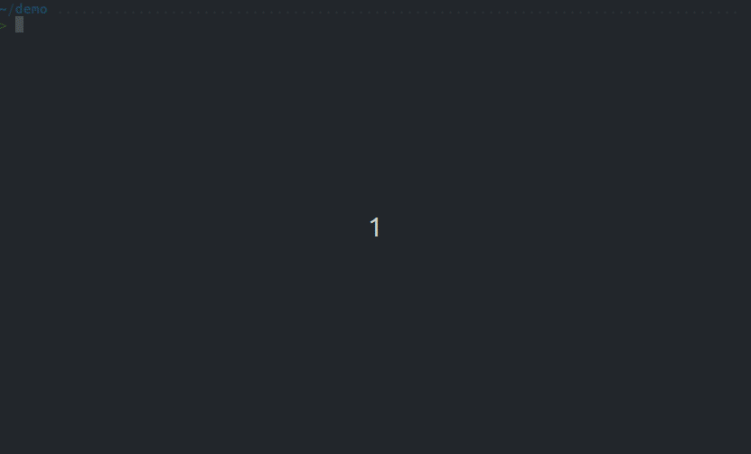

<p align="center">
  <!--  -->
</p>

<h1 align="center">:eyeglasses: `bieye`</h1>

This Rust-based CLI tool reads text and returns it back in bionic reading format
for blazingly fast loading and even faster reading!

Bionic reading is the reading of specially formatted text, allowing for
faster reading. This is possible by strategically highlinting pieces
of text, which tricks the brain of reading without losing content.

**Essentially:** Use this tool to speed up your text reading while using the console

<p align="center">
  
</p>

## Installation

Note: This is a temporary cargo-based installation,
Homebrew and apt packages to come.

1. _(if needed)_ Install Rust and Cargo Package Manager

   - MacOS/Linux: `curl --proto '=https' --tlsv1.2 -sSf https://sh.rustup.rs | sh`
   - Windows:
     - Chocolatey: `choco install rust`
     - Scoop: `scoop install main/rust`

2. Pull this GitHub repository and install

   - ```bash
     git clone git@github.com:ismet55555/bieye.git
     cd bieye
     cargo install --path .
     bieye --help
     ```

## Usage Examples

The following are a few simple usage examples for `bieye`

```bash
# Simple text specification
bieye "Hello there, how is your day going?"

# Piping standard out into bieye
cat README.md | bieye
man git | bieye
echo "HELLO! hello hello elo el ..." | bieye

# Add some output options
cat quest.md | bieye --color --dim
```

## CLI Menu

```txt
$ bieye -h

bieye v0.0.0

This CLI tool reads text and returns it back in bionic reading format
for blazingly fast loading and even faster reading!

Usage: bieye [OPTIONS] [TEXT]

Arguments:
  [TEXT]  Capture text from stdin

Options:
  -c, --color    Color highlighted text
  -d, --dim      Dim text not highlighted
  -h, --help     Print help (see more with '--help')
  -V, --version  Print version
```

## Development

Feel free to contribute! Here is a super quick start if you are vaguely familiar with Rust.

```bash
# Setup
git clone git@github.com:ismet55555/bieye.git
cd bieye
git checkout -b my-cool-new-branch
cargo build

# ... work work work ...

# Test run it
cargo run -- --help
echo "Just some testing text" | cargo run --

# Other terminal windows
cargo install --locked bacon
bacon --all-features
```
